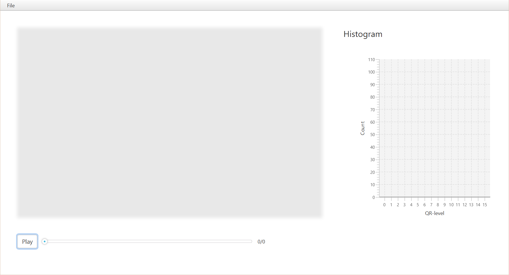

# CMPT365 Assignment2 Report
> Group Member: 
>
> - VertexC
> - Leo

### Features list

#### Required Features:

- [x] use the java skeleton
- [x] can loads a video
- [x] user is able to select whatever video to be loaded
- [x] click sound between each frame 
- [x] convert image of each frame into sound

#### Extra Features:

- [x] add play/stop button
- [x] add slider, slider moves as video plays, and user can drag slider to change the frame to be played
- [x] add frame count prompt, shown as currentFrame/totalFrame
- [x] add histogram, which shows the image's RBG information of the current frame
- [x] add CSS, to beautify the UI

<div style="margin-bottom:40px;padding:150px;">

</div>


### Screen Shot of the Program
<div style="border:10px solid grey"> 

</div>


### Implementation

#### File Selector

<div style="font-size:13px">In RootLayoutController,add open event on "Open Video" menu item. When user select the file from the dialog, get the file path and store it in public variable in mainApp.c</div>

```java
@FXML
private void openVideo(){
    Stage dialogStage = new Stage();
    FileChooser fileChooser = new FileChooser();
    fileChooser.setTitle("Open the Source File");
    File file = fileChooser.showOpenDialog(dialogStage);
    if (file != null){
        mainApp.setOpenedFilePath(file.getPath());
    }
}   
```

<div style="margin-bottom:10px;padding:30px;">

</div>

#### Video player

The video player utilizes the OpenCV `VideoCapture` and `Mat` class. 

##### 1. Open the video file

`VideoCapture` class provide convenient  way to open a video file, by calling `VideoCapture.open("path_to_video");`.

##### 2. Get each frame and display

After opening, we have to convert each frame of the video to individual `Mat` instance. This can be done by `VideoCapture.read(Mat frame)` function.

After we get the image as `Mat` object, we need to display it in the `ImageView` object on the window, which requires a `Image` object rather than `Mat` object. Thus I utilize the `Utilities.mat2Image(Mat)`  function provided in `Utilities` class to convert the frame to `Image` object that can be directly displayed.

##### 3. Use multithreading to avoid blocking

The second step (Get each frame and display) need to repeat for each frame of the video. So `ScheduledExecutorService` is used as a timer that can execute the playing task on schedule. In this case we use `4 second` as the timer interval to make sure the sound of one frame can finish playing.

```java
Runnable frameGrabber = new Runnable() {
    @Override
    public void run() {
        // instructions described in step 2
    }
videoTimer = Executors.newSingleThreadScheduledExecutor();
videoTimer.scheduleAtFixedRate(frameGrabber, 0, videoTimerPeriod, TimeUnit.MILLISECONDS);
```

The advantage of using `ScheduledExecutorService`  is that it is multithreading. The video player can be executed in another thread that is different from the `FXThread` that do the UI jobs. Thus the other interaction between user and the windows is not affected by the video player (avoid blocking).

<div style="margin-bottom:40px;padding:30px;">

</div>

#### Slider

<div style="font-size:13px"> Add a listener to slider, when its value(position) changes, set the frame of opened video according to the slider's position. </div>

```java
// for video capture
slider.valueChangingProperty().addListener(new ChangeListener<Boolean>() {
    public void changed(ObservableValue<? extends Boolean> observable, Boolean oldValue, Boolean newValue) {
        if (capture.isOpened()) {
            double currentSliderPosition = slider.getValue();
            double totalFrameCount = capture.get(Videoio.CAP_PROP_FRAME_COUNT);
            double toSetFrameNumber;
            toSetFrameNumber = (currentSliderPosition - slider.getMin())
                    / (slider.getMax() - slider.getMin()) * totalFrameCount;
            capture.set(Videoio.CAP_PROP_POS_FRAMES, toSetFrameNumber);
        }
    }
});
```

#### Click Sound
<div style="font-size:13px">For click sound between frames, Clip would be a good implementation as the sounds is relatively short. We download a 1s click sound .wav and load it into clip. </div>

```java
// load in click .wav
File soundFile = new File("source/sound/briefcase-lock-5.wav");
clip = AudioSystem.getClip();
try {
    AudioInputStream inputStream = AudioSystem.getAudioInputStream(soundFile);
    clip.open(inputStream);
} catch (IOException e) {
    System.err.println("Cannot open the clip file.");
} catch (UnsupportedAudioFileException e) {
    System.err.println("Wrong file format for clip.");
}
```
<div style="font-size:13px">In each run of video frame, the clip is played before the image.</div>

```java
// play the click
Runnable frameGrabber = new Runnable() {
    @Override
    public void run() {
        ...
        // play the clip
            clip.stop();
            clip.setFramePosition(0);
            clip.start();
        ...
    }
}
```
#### Image to Sound

##### 1. Image pre-processing

In order to convert each frame of a video as sound as described in assignment requirement, we need to simplify the image first and make it contains less information.

We convert the image from `GRB` channel to `Grayscale` channel by calling `Imgproc.cvtColor` provided by OpenCV and then resize it to `64*64` size.

```java
Imgproc.cvtColor(image, grayImage, Imgproc.COLOR_BGR2GRAY);
Imgproc.resize(grayImage, resizedImage, new Size(width, height));
```

Then we need to quantize the image color from 0~255 to 0~15. This operation should be done for every pixel in the image

```java
for (int row = 0; row < resizedImage.rows(); row++) {
    for (int col = 0; col < resizedImage.cols(); col++) {
            roundedImage[row][col] = (double) Math.floor(resizedImage.get(row, col)[0] / (256 / numberOfQuantizationLevels)) / numberOfQuantizationLevels;
    }
}
```

##### 2. Iterate each column and play sound

Once we get the rounded image matrix, we can convert column by column.

For each column we have 500 samples, each of which is one byte long. 

For each sample, we use $signal=sum(sin(2\pi freq(m) * percentage\_of\_time))$, where $m$ is the relative pitch of a row, with deeper row lower pitch.

After compute the signal, we normalized it between the $[-2^7, 2^7-1]$, then write it to audio buffer.

```java
byte[] audioBuffer = new byte[numberOfSamplesPerColumn];
for (int t = 1; t <= numberOfSamplesPerColumn; t++) {
    double signal = 0;
    for (int row = 0; row < height; row++) {
        int m = height - row - 1; // Be sure you understand why it is height rather width, and why we subtract 1
        int time = t + col * numberOfSamplesPerColumn;
        double ss = Math.sin(2 * Math.PI * freq[m] * (double) time / sampleRate);
        signal += roundedImage[row][col] * ss;
    }
    double normalizedSignal = signal / height; // signal: [-height, height];  normalizedSignal: [-1, 1]
    audioBuffer[t - 1] = (byte) (normalizedSignal * 0x7F); // Be sure you understand what the weird number 0x7F is for
}
sourceDataLine.write(audioBuffer, 0, numberOfSamplesPerColumn);
```

##### 3. Use multithreading to avoid blocking

We also use multithreading, i.e.,  `ScheduledExecutorService`  to avoid blocking. The code is similar to 'Video player' part.

#### Histogram

<div style="font-size:13px">The main idea of histogram is to show the disribution of the color value across the image. For histogram, after getting the quantilized color value of resized grey image, we group them into different catagries according to the range of value.
</div>

```java
double[][] processedImage = processImage(resizedFrame);
    // make the frame into grey
    // build up the histogram according to its grey value
    int group[] = new int[numberOfQuantizationLevels]; // 0 - 15, 16 - 31, ..., 240 - 255
    for (int i = 0; i < numberOfQuantizationLevels; i++) {
        group[i] = 0;
    }
    for (int i = 0; i < height; i++) {
        for (int j = 0; j < width; j++) {
            group[(int) Math.floor(processedImage[i][j] * numberOfQuantizationLevels)] += 1;
        }
    }
    XYChart.Series<String, Integer> series = createHistogramSeries(group);
    // put the data into bar chart
    Platform.runLater(() -> {
                histogram.getData().setAll(series);
            }
    );

    private XYChart.Series<String, Integer> createHistogramSeries(int[] group) {
    XYChart.Series<String, Integer> series = new XYChart.Series<String, Integer>();
    for (int i = 0; i < group.length; i++) {
        XYChart.Data<String, Integer> data = new XYChart.Data<String, Integer>(valueRange.get(i), group[i]);
        series.getData().add(data);
    }
    return series;
}
```

#### User Interface

`Bootstrap` stylesheet is used in our user interface design, which provide the UI elements with elegant modern style.

For example, the buttons' style can be seen from the following screenshot.

Another important style is the blurring shadow effect of the video player part. This is done by adding a `StackPane` outside the `ImageView` element, and set the `-fx-effect`, -`fx-background-color` of `StackPane` to

```css
-fx-effect: dropshadow(three-pass-box, rgba(0,0,0,1), 10, 0, 0, 0); 
-fx-background-color: rgba(255, 255, 255,0.1);
```

Finally, add proper padding between elements and make them not stack together.


